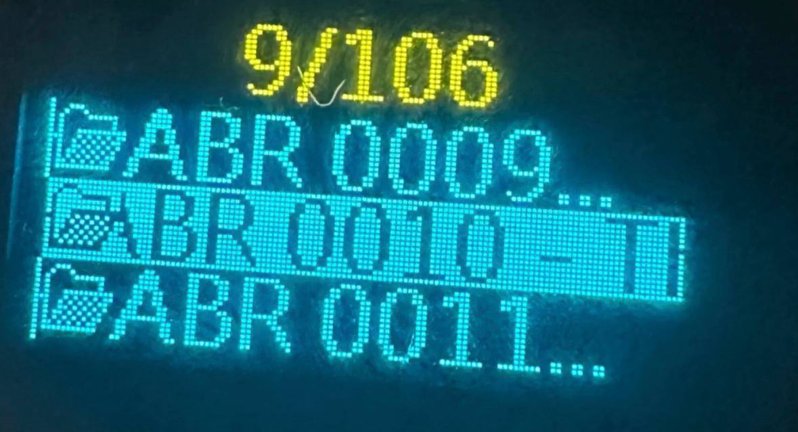

# X2S Sort

A small utility to fix album/track ordering on the **xDuoo X2S** player.




The X2S sorts folders/files *lexicographically* and, in many cases, by the **directory entry order** (FAT/exFAT), not strictly by name. This tool:

- Pads numbers in names so lexicographic order matches numeric order.
- Optionally **recreates directory entry order** to match the sorted names (important for X2S).
- Works recursively for a chosen folder.

## Downloads

Prebuilt installers are available on the GitHub Releases page (Windows `.exe`, macOS `.dmg`).

Note: builds are **unsigned**, so Windows SmartScreen and macOS Gatekeeper will show warnings. You can still run them by confirming the prompt.

Release tags are expected in the form `v1.1.1`. The installer uses numeric version `1.1.1` (required by `jpackage`).

## Quick Start (Linux/macOS)

### 1) Build & Run (GUI)

```
make run
```

This will:
- Check for Java and Clojure
- Build a runnable `jar`
- Launch the GUI

### 2) Run the built jar

```
java -jar target/x2s-sort.jar
```

## Windows

If you have `java` installed, you can run the built jar:

```
java -jar target\x2s-sort.jar
```

If you don’t have Java, install a JRE or JDK first (Temurin, Oracle, etc.).

## Requirements

To **build** the jar (used by `make run`):
- Java (JRE/JDK)
- Clojure CLI tools

To **run** an already-built jar:
- Java only

## How It Works

Example input:

```
ABR 1 - ...
ABR 2 - ...
ABR 10 - ...
```

After processing:

```
ABR 01 - ...
ABR 02 - ...
ABR 10 - ...
```

When **Recreate order** is enabled, the program rebuilds the directory entry order so players like xDuoo X2S follow the intended sequence.

## GUI Usage

1. Click **Browse** and choose a folder (e.g. your `music` folder on the SD card).
2. Optionally enable:
   - **Dry run**: show planned changes without applying
   - **Recreate order**: fixes devices that ignore sorting
3. Click **Run**.

## CLI Usage

```
clojure -M -m x2s-sort.core /path/to/folder --reorder
```

Options:
- `--dry-run` — preview changes only
- `--reorder` — rebuild directory entry order
- `--gui` — launch GUI (default when no args)

## Safety Notes

- For safety, test on a copy first.
- If you already ran the tool, re-running may show “Nothing to rename.”

## Build Outputs

- `target/x2s-sort.jar`
- `run.sh` (helper script on Linux/macOS)

---

## Releasing (maintainers)

Create and push a tag to build installers in GitHub Actions:

```
git tag v1.1.1
git push origin v1.1.1
```

Artifacts will appear in GitHub Releases.

---

If you want signed installers, I can wire up code-signing for Windows and macOS.
